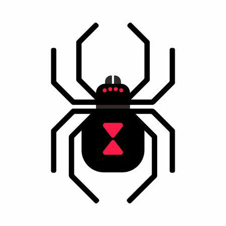

# Black Widow


## CTF Tool (Language: [python3.7](https://www.python.org/downloads/))

#### Dipendenze:
 - [pyshark](https://pypi.org/project/pyshark/): `sudo pip3 install pyshark`
 - [PyQt5](https://pypi.org/project/PyQt5/): `sudo pip3 install PyQt5`
 - [PyQtWebEngine](https://pypi.org/project/PyQtWebEngine/): `sudo pip3 install PyQtWebEngine`
 - [PyTidyLib](https://pypi.org/project/pytidylib/): `sudo pip3 install pytidylib`
 - [Sqlmap](https://pypi.org/project/sqlmap/): `sudo pip3 install sqlmap`
 - [Sqlmap](https://pypi.org/project/argparse/): `sudo pip3 install argparse`

#### Funzionalità:
 - Sniffing (anche con regex sul contenuto delle richieste/risposte) per rubare flag catturate da altri;
 - Invio automatico di flag al gaming server;
 - Invio stessa richiesta a terminali multipli (per sfruttare contemporaneamente le stesse vulnerabilità di più server);
 - Storico mappa {server -> vulnerabilità} sfruttate (condiviso) per evitare ripetizione attacchi già andati a buon fine;
 - Cluster per evitare di effettuare stessi attacchi contemporaneamente e per velocizzare ad esempio il bruteforce;
 - Il tool di ogni macchina comunicherà in modo criptato e autenticato (RSA) con gli altri tool nella rete;

Suggerite voi altre funzionalità (comunque ci verranno in mente con l'esperienza sulle CTF).

#### Directories:
```
[root]
  |
  |-- app/      # Package principale dell'applicazione
  |    |
  |    |-- attack/         # Package per modalità di attacco
  |    |-- defense/        # Package per modalità di difesa
  |    |
  |    |-- gui/            # Package per la grafica dell'applicazione
  |    |
  |    |-- storage/        # Package per salvare i files (settings, output, ...)
  |    |
  |    |-- utils/
  |    |    |
  |    |    |-- cluster/        # Package che fornisce metodi per condividere e ricevere info
  |    |    |-- crypto/         # Package per criptare/decriptare/codificare/decodificare stringhe e files
  |    |    |-- exceptions/     # Eventuali eccezioni personalizzate
  |    |    |-- helpers/        # Package contenente helpers generici usati in più parti del programma
  |    |    |-- history/        # Package che fornisce classi e funzioni per salvare cronologie di vario tipo
  |    |    |-- html/           # Package che fornisce metodi per fare il parsing di un html
  |    |    |-- requests/       # Package che fornisce metodi per effettuare richieste (anche multiple)
  |    |    |-- settings/       # Package dedito al settaggio di parametri globali (es. IP gaming server, ...)
  |    |    |-- sniffing/       # Package che fornisce metodi per sniffing in una rete
  |    |    |-- sql/            # Package che fornisce metodi per sql injection
  |    |
  |    |-- env.py          # Variabili d'ambiente
  |
  |-- main.py   # Eseguibile principale
  |-- test.py   # Eseguibile di testing
```

##### GitHub repository:
`git@github.com:FabrizioFubelli/black-widow.git`

##### Private Fabrizio Fubelli's repository:
`secret`

<hr/>

#### [© Fabrizio Fubelli](https://fabrizio.fubelli.org)
