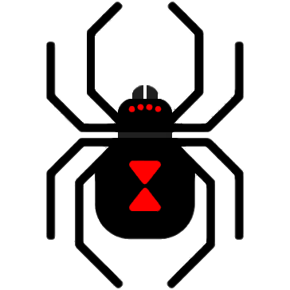

# Black Widow

[](https://www.python.org/) [](https://raw.githubusercontent.com/FabrizioFubelli/black-widow/master/LICENSE)




## Offensive penetration testing tool (Open Source)


### Features:
 - Sniffing
 - SQL Injection
 - Injected-database management
 - Website parser
 - Website crawler
 - Multiple targets management
 - Mapping **{server -> vulnerabilities}**
 - Cluster between **black-widow** that are running within the same network
 - Encrypted communications between others **black-widow**
 - Useful features for CTF challenges

##### Suggest you other features!


### Links:
 - Homepage: [https://black-widow.io](https://black-widow.io)
 - GitHub: [https://github.com/FabrizioFubelli/black-widow](https://github.com/FabrizioFubelli/black-widow)


### Main dependencies:
 - [PyShark](https://pypi.org/project/pyshark/): `sudo pip3 install pyshark`
 - [Sqlmap](https://pypi.org/project/sqlmap/): `sudo pip3 install sqlmap`
 - [Argparse](https://pypi.org/project/argparse/): `sudo pip3 install argparse`
 - [PyQt5](https://pypi.org/project/PyQt5/): `sudo pip3 install PyQt5`
 - [PyQtWebEngine](https://pypi.org/project/PyQtWebEngine/): `sudo pip3 install PyQtWebEngine`
 - [PyTidyLib](https://pypi.org/project/pytidylib/): `sudo pip3 install pytidylib`


### Directories:
```
[root]
  |
  |-- app/      # Package principale dell'applicazione
  |    |
  |    |-- attack/         # Package per modalità di attacco
  |    |-- defense/        # Package per modalità di difesa
  |    |
  |    |-- gui/            # Package per la grafica dell'applicazione
  |    |
  |    |-- storage/        # Package per salvare i files (settings, output, ...)
  |    |
  |    |-- utils/
  |    |    |
  |    |    |-- cluster/        # Package che fornisce metodi per condividere e ricevere info
  |    |    |-- crypto/         # Package per criptare/decriptare/codificare/decodificare stringhe e files
  |    |    |-- exceptions/     # Eventuali eccezioni personalizzate
  |    |    |-- helpers/        # Package contenente helpers generici usati in più parti del programma
  |    |    |-- history/        # Package che fornisce classi e funzioni per salvare cronologie di vario tipo
  |    |    |-- html/           # Package che fornisce metodi per fare il parsing di un html
  |    |    |-- requests/       # Package che fornisce metodi per effettuare richieste (anche multiple)
  |    |    |-- settings/       # Package dedito al settaggio di parametri globali (es. IP gaming server, ...)
  |    |    |-- sniffing/       # Package che fornisce metodi per sniffing in una rete
  |    |    |-- sql/            # Package che fornisce metodi per sql injection
  |    |
  |    |-- env.py          # Variabili d'ambiente
  |
  |-- main.py   # Eseguibile principale
  |-- test.py   # Eseguibile di testing
```


### Useful commands:
 - Update dependencies: `pip3 freeze > requirements.txt`


### Authors:
 -  [Fabrizio Fubelli](https://fabrizio.fubelli.org)
