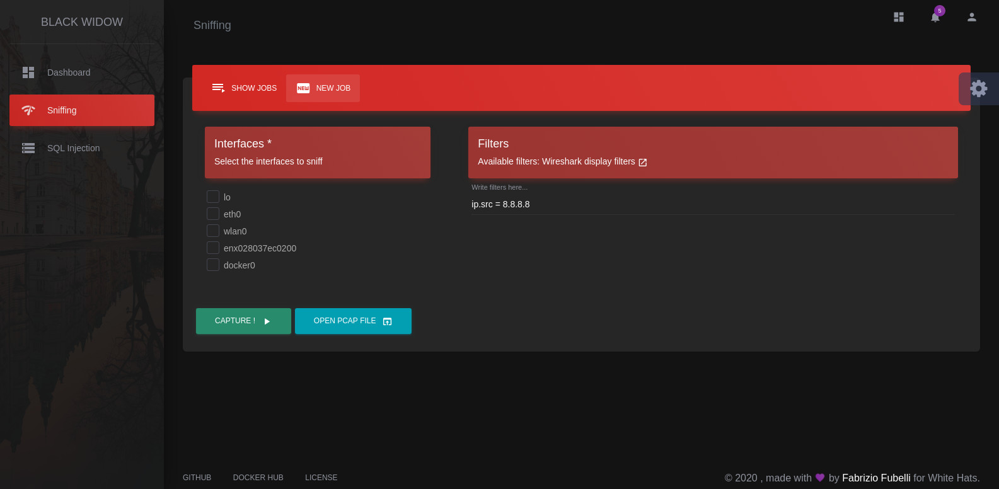

# gui

## **black-widow** provides a very modern, simple and fast graphical user interface.

Unlike most cyber security and penetration testing tools, black-widow has a pretty **Web GUI** built with [**Django**](https://www.djangoproject.com/) and served by the integrated ****[**Gunicorn Server**](https://gunicorn.org/).

The package [app.gui](https://github.com/offensive-hub/black-widow/tree/master/app/gui) implements a complete **Django** application which interface with **black-widow** [managers](managers/).

The Django application use a [SQLight](https://sqlite.org/index.html) database to save the necessary data. That database is stored on default black-widow [storage](https://github.com/offensive-hub/black-widow/tree/master/app/storage) path.

## app.gui

* [manage.py](https://github.com/offensive-hub/black-widow/blob/master/app/gui/manage.py) Implements the methods **django\_gui\(\)** and **django\_cmd\(...\)**:
  * **django\_gui\(\)** starts the Gunicorn server and opens the default user browser;
  * **django\_cmd\(...\)** executes a django command with user inputs.
* [web](https://github.com/offensive-hub/black-widow/tree/master/app/gui/web) Django project package root
  * [web.black\_widow](https://github.com/offensive-hub/black-widow/tree/master/app/gui/web/black_widow) The main Django application package, which implements [**views**](https://github.com/offensive-hub/black-widow/tree/master/app/gui/web/black_widow/views), [**models**](https://github.com/offensive-hub/black-widow/tree/master/app/gui/web/black_widow/models), and [**templates**](https://github.com/offensive-hub/black-widow/tree/master/app/gui/web/black_widow/templates)\*\*\*\*
  * [web.settings.py](https://github.com/offensive-hub/black-widow/blob/master/app/gui/web/settings.py) Django settings for web project
  * [web.urls.py](https://github.com/offensive-hub/black-widow/blob/master/app/gui/web/urls.py) Django URL Configuration
  * [web.wsgi.py](https://github.com/offensive-hub/black-widow/blob/master/app/gui/web/wsgi.py) Used directly by Gunicorn and contains the WSGI config for Django project

